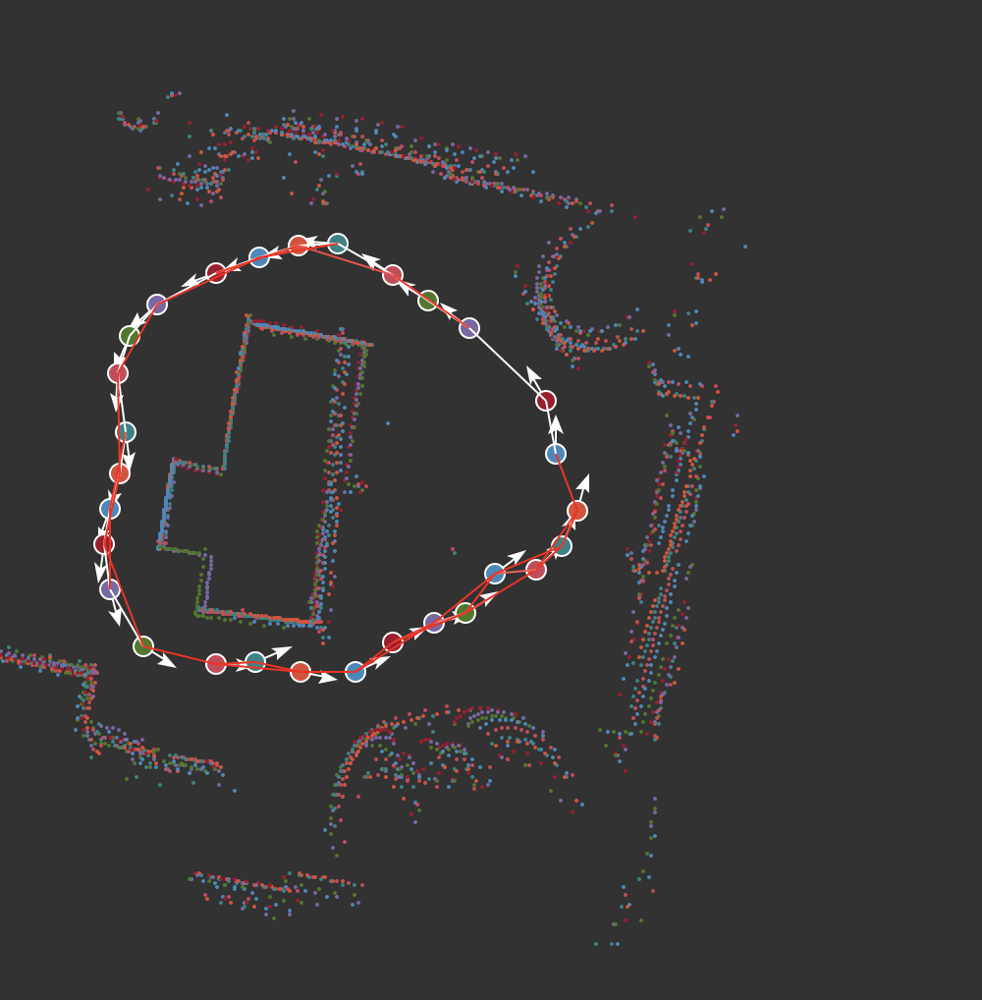
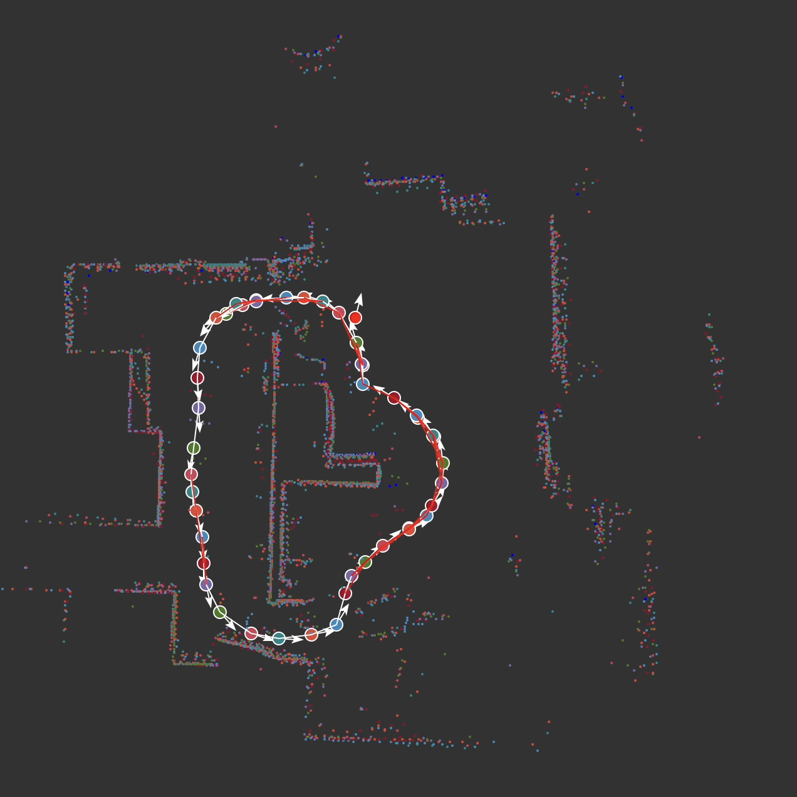

# uSlam

Lidar based SLAM using Pose Graph Optimisation. 






# Tools

- `python main.py` - Listens for data from the robot and does SLAM
- `python optimization.py` - Takes an offline saved map and after 5 seconds starts optimizaing it.

- `python tools/simulator.py` - Drive a simualted robot around an envorment using your keyboard. Draw obstacles with your mouse, right click to delete
- `python tools/viz.py` - Vizualize lidar data coming from the robot
- `python tools/save.py filename` - Record odometery and lidar data from the robot
- `python tools/replay.py filename` - Play back a saved odometery and lidar file

- `data/` - Save playback and unoptimized graph data


# Notes

using a lot of tools here will require you to be on the 10.0.0.X subnet as they use [UDPComms](https://github.com/stanfordroboticsclub/UDPComms) to communitate with the robot and each other


# install 
for cvxopt seee https://github.com/cvxopt/cvxopt/issues/78

```
wget http://faculty.cse.tamu.edu/davis/SuiteSparse/SuiteSparse-4.5.3.tar.gz
tar -xf SuiteSparse-4.5.3.tar.gz
export CVXOPT_SUITESPARSE_SRC_DIR=$(pwd)/SuiteSparse
```